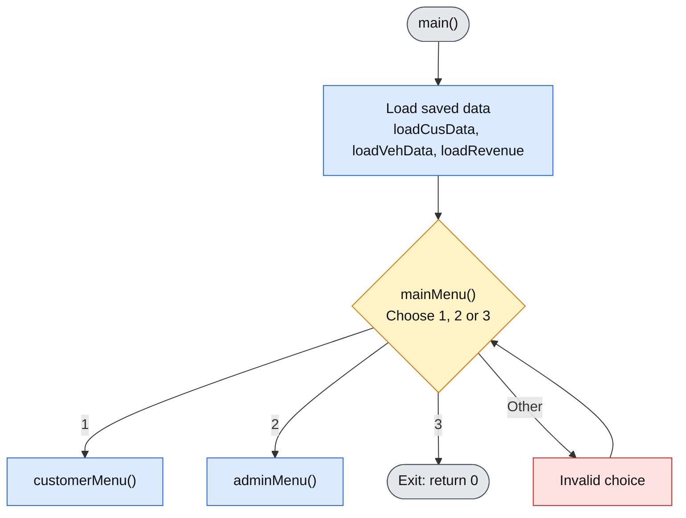
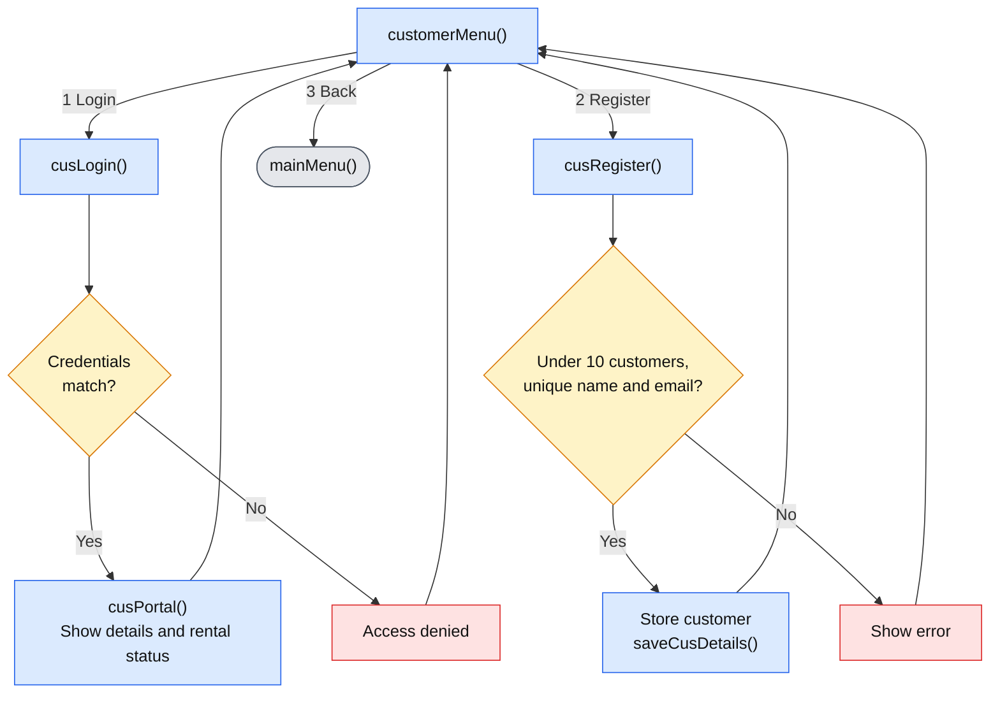
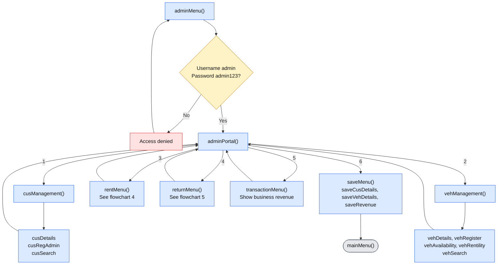
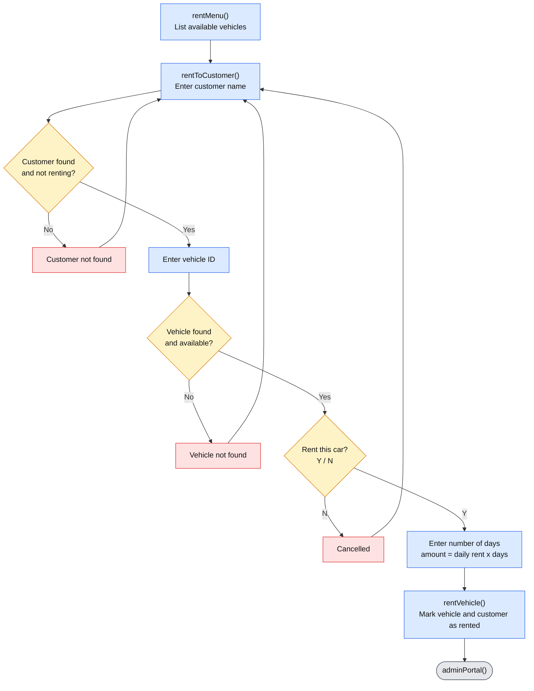
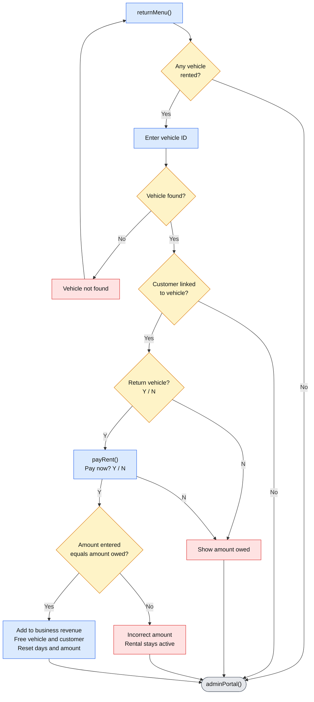

# Vehicle-Rental-System-C-
# 🚗 Vehicle Rental System

A menu-driven, console-based **vehicle rental management system** written in C++. It manages customers, vehicles, rentals, returns and business revenue, and stores everything in plain text files so data persists between runs.


---

## 📑 Table of Contents

- [Features](#-features)
- [Requirements](#-requirements)
- [Getting Started](#-getting-started)
- [Usage Guide](#-usage-guide)
- [Program Flow (Flowcharts)](#-program-flow-flowcharts)
- [Data Files](#-data-files)
- [Project Structure](#-project-structure)
- [System Limits and Defaults](#-system-limits-and-defaults)
- [Known Limitations](#-known-limitations)
- [Future Improvements](#-future-improvements)

---

## ✨ Features

**Customer Portal**
- Register with name, phone, email and password (email becomes the username)
- Log in and view personal details and current rental status
- See rented vehicle details and the amount owed

**Admin Portal**
- **Customer management:** list, register and search customers (by email)
- **Vehicle management:** list, register, search (by ID), view available and rented vehicles
- **Rent a vehicle:** pick a customer, a vehicle and the number of days; the total is calculated automatically
- **Return a vehicle:** confirm the return and pay the exact amount owed
- **Transaction details:** view total business revenue
- **Save/Exit:** write all data to files

---

## 🛠 Requirements

| Item | Requirement |
|------|-------------|
| Language | C++ |
| Standard | C++11 or later (uses `std::to_string` and `std::stof`) |
| Compiler | g++ 4.8+, Clang 3.3+, MinGW-w64 or MSVC (VS 2015+) |
| Libraries | Standard library only: `<iostream>`, `<string>`, `<fstream>` |
| OS | Windows, Linux or macOS |
| Hardware | Any machine that can run a console program (about 64 MB RAM) |

No third-party libraries are needed.

---

## 🚀 Getting Started

**1. Clone the repository**

```bash
git clone https://github.com/<your-username>/<your-repo>.git
cd <your-repo>
```

**2. Compile**

```bash
g++ -std=c++11 main.cpp -o VehicleRental
```

**3. Run**

```bash
./VehicleRental          # Linux / macOS
VehicleRental.exe        # Windows
```

The data files are created in the working directory the first time you save.

---

## 📖 Usage Guide

### Main menu

```
1. Customer Portal
2. Admin Portal
3. Exit
```

### Default admin login

| Field | Value |
|-------|-------|
| Username | `admin` |
| Password | `admin123` |

> ⚠️ These credentials are hard-coded for demonstration. Change them in `adminMenu()` before real use.

### Typical workflow

1. **Admin** logs in and registers vehicles (*Vehicle Management → Vehicle Registration*).
2. A **customer** registers (*Customer Portal → Register*), or the admin registers them.
3. **Admin** rents a vehicle (*Rent Vehicle*): choose customer, vehicle ID and number of days.
4. **Customer** logs in to view rental status and the amount owed.
5. **Admin** returns the vehicle (*Return Vehicle*) and enters the exact amount owed.
6. **Admin** checks revenue (*Transaction Details*).
7. **Admin** chooses *Save/Exit*, then *Exit* from the main menu.

> 💡 Always use **Save/Exit** before closing so that data is written to disk.

---

## 🔀 Program Flow (Flowcharts)

The diagrams below follow the actual call sequence in the code, using the real function names.

**Legend:** 🟦 normal step · 🟨 decision · 🟥 error or rejection · ⬜ start/end

### 1. Startup and main menu



### 2. Customer portal



### 3. Admin portal (hub)

Every admin option returns to `adminPortal()`, except **Save/Exit**, which returns to `mainMenu()`.



### 4. Rent a vehicle



### 5. Return a vehicle and pay rent



> **Note:** the menus call each other recursively instead of using loops, so every function ends by calling the next menu function rather than returning.

---

## 💾 Data Files

Created automatically in the program's working directory.

| File | Contents |
|------|----------|
| `RegisteredCustomers.txt` | Name, phone, email, username, password, rental status, vehicle index, days, amount due |
| `RegisteredVehicles.txt` | Vehicle ID, name, identification number, rented flag, daily rent |
| `Revenue.txt` | Total business revenue |

- If a file is missing at startup, the program starts with empty data.
- Data is saved on **Save/Exit**; customer self-registration also saves immediately.
- Do not edit these files by hand. The format is line-based.

---

## 📁 Project Structure

```
.
├── main.cpp                   # Complete source code
├── README.md                  # This file
├── requirement.txt            # Requirements document
├── userguide.txt              # Detailed user guide
├── RegisteredCustomers.txt    # Generated at runtime
├── RegisteredVehicles.txt     # Generated at runtime
└── Revenue.txt                # Generated at runtime
```

---

## ⚙️ System Limits and Defaults

| Setting | Value |
|---------|-------|
| Maximum customers | 10 |
| Maximum vehicles | 10 |
| Active rentals | 1 per customer, 1 customer per vehicle |
| Vehicle ID format | `VEH-1`, `VEH-2`, ... (auto-generated) |
| Currency | Rs. |
| Daily rent | Numbers only (e.g. `5000`) |

---

## ⚠️ Known Limitations

- Passwords are stored in **plain text**.
- Typing a letter at a numeric menu prompt can cause an endless input loop (no `cin.fail()` handling).
- Menus use **recursion** instead of loops, so very long sessions grow the call stack.
- Daily rent is stored as a string and converted with `stof()`; a non-numeric value will crash the program.
- Customers registered by the admin are saved only on **Save/Exit**.
- Customers cannot rent or return vehicles themselves.
- Fixed-size arrays limit the system to 10 customers and 10 vehicles.

---

## 🔮 Future Improvements

- [ ] Hash passwords before saving
- [ ] Validate all input (`cin.fail()`, `cin.clear()`, `cin.ignore()`)
- [ ] Replace recursive menus with a main loop and `switch`
- [ ] Use `struct`/`class` and `std::vector` instead of parallel arrays
- [ ] Store daily rent as a number and validate it
- [ ] Let customers request rentals and view their history
- [ ] Add a rental history/transaction log

---

## 📄 License

Add your preferred license here (for example, MIT).
